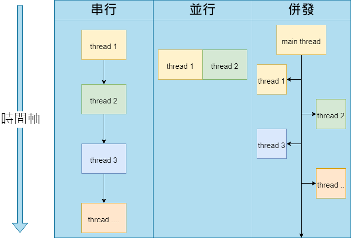
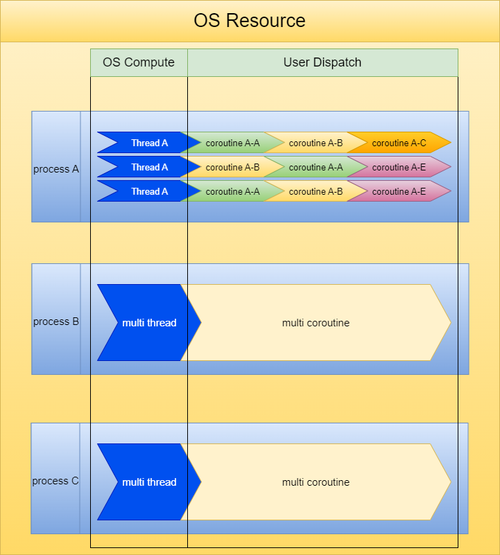

# Java 多執行緒學習
內容說明 Java 從 1.5 提供的 Future、Runnable、Callable 介面到後來 1.8 CompletableFuture 物件,不斷改進對於多執行緒操作的方式及模式，並且針對資源鎖定和底層 JVM 有更多效能上的優化及更多的彈性

## 任務執行方式主要分類
1. 串行
2. 並行: 同一時間執行
3. 併發: 不同時間段  

## 並行和併發程序概念
1. 進程(Process): 電腦OS執行分配資源的最小單位
2. 線程(Thread): 電腦OS運算資源的最小單位
3. 協程(coroutine): 線程內運算資源調度的單位，可由使用者自行調度(Python、Javascript、C等語言有)   

## Index
* [Java 多執行緒操作物件](./src/main/java/lesson01/note01.md)
* [Java 多執行緒資源鎖](./src/main/java/lesson02/note02.md)