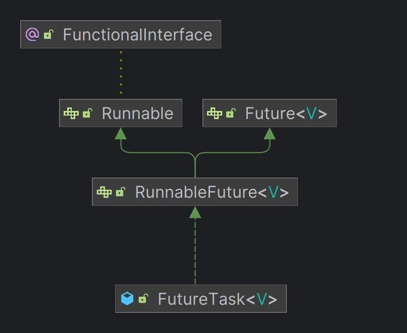
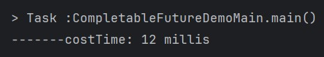
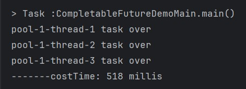
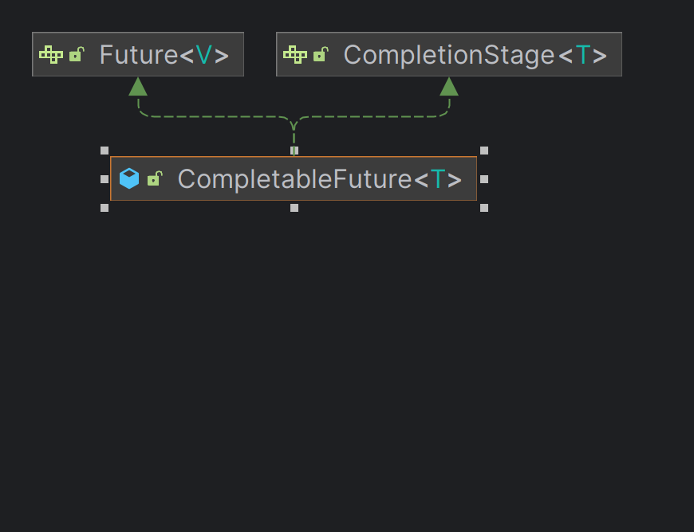

### Daemon Thread 和 User Thread 差異
1. Daemon thread 為背景執行緒，User thread 為使用者執行緒
2. Main thread 不會等待 Daemon thread 回傳結果，反之會等待 User thread 回傳結果

### Future 介面
Future 為 java 1.5 提供的異步執行規範介面

### FutureTask 有無取用結果時間差異
無get結果   
   
有get結果   
   

### FutureTask 缺點
1. 當 FutureTask 的 get 先被呼叫時就必須等待返回結果，導致後續動作被阻塞
2. 若使用 isDone + while(true) 隨時判斷是否做完，會導致執行緒空輪詢

### CompletableFuture 針對 FutureTask 的改進
1. 當異步任務計算完成會主動通知完成
2. 可以更詳細的處理異步任務的步驟

### CompletableFuture 說明
1. 主要繼承 Future 和 CompletableStage 介面  
   
2. supplyAsync 有返回值，runAsync 無返回值([example](CompletableFutureDemoMain.java))
3. CompletableFuture 未指定 thread pool 時，預設使用 ForkJoinPool 類型 thread pool

### CompletableFuture 特點
1. 可已透過 whenComplete 來指定等到異步任務時再作後續任務，其他主線程任務則繼續進行其他任務([example](CompletableFutureWhenDemoMain.java))
2. 當異步任務拋出異常時可以透過 exceptionally 捕捉錯誤並做例外處理
3. CompletableFuture 可以透過 get 和 join 取得返回結果，兩者差異為 get 會拋出檢查例外，join 會拋出非檢查例外

### CompletableFuture 注意事項
1. 因 CompletableFuture 預設使用 ForkJoinPool 為 Daemon 類型 thread pool 所以會發生若主線程未等待 CompletableFuture 就結束的情況
2. 若指定 thread pool 非使用預設 ForkJoinPool 則須注意要自行 shutdown thread pool 

### CompletableFuture 取值方式
[example](CompletableFutureGetResultDemoMain.java)
1. get(): 等待執行完後取值，會造成阻塞
2. get(long, TimeUnit): 等待指定秒數後取值，會造成些微阻塞
3. join(): 等待執行完後取值，會造成阻塞(與 get 差別在於是拋出非檢查例外)
4. getNow(T valueIfAbsent): 當下直接取值，若沒執行完成則回傳 valueIfAbsent 指定值
5. complete(T valueIfAbsent): 當下直接取值，並且回傳是否中斷執行

### CompletableFuture 方法說明
1. [thenApply(Function<T>)](CompletableFutureApplyDemoMain.java): 將不同的任務依照順序串聯起來，並且結果會依需傳下去，發生錯誤時會直接中斷任務
2. [handle()](CompletableFutureApplyDemoMain.java): 將不同的任務依照順序串聯起來，並且結果會依需傳下去，發生錯誤時會繼續下一個任務
3. [thenRun(Runnable)](CompletableFutureAcceptDemoMain.java): 不需要上一個步驟的結果也不須傳遞結果
4. [thenAccept(Consumer<T>)](CompletableFutureApplyDemoMain.java): 直接消費上一個步驟的結果，傳遞結果下去
5. [thenXXXASync](CompletableFutureAsyncDemoMain.java): 所有以上方法都有對應的異步模式但現程使用會有一些差異
   1. 正常情況下都是使用 ForkJoinPool 也可以指定 thread pool
   2. 若指定 thread pool 下一個異步方法會使用相同 thread pool，但當下一個方法為 Async 類型時則不會使用

### CompletableFuture 結果模式
1. [先取用先完成的任務結果](./CompletableFutureSelectFastDemoMain.java)
2. [將所有結果合併](./CompletableFutureCombineDemoMain.java)